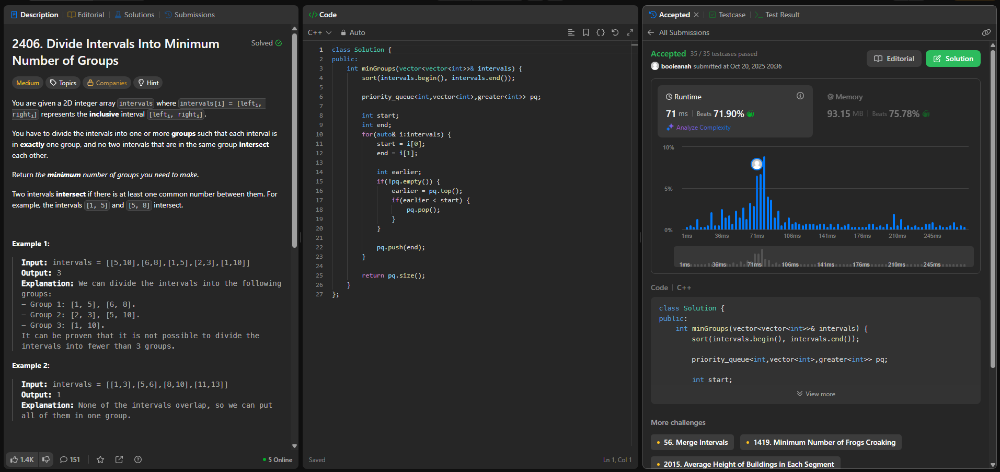
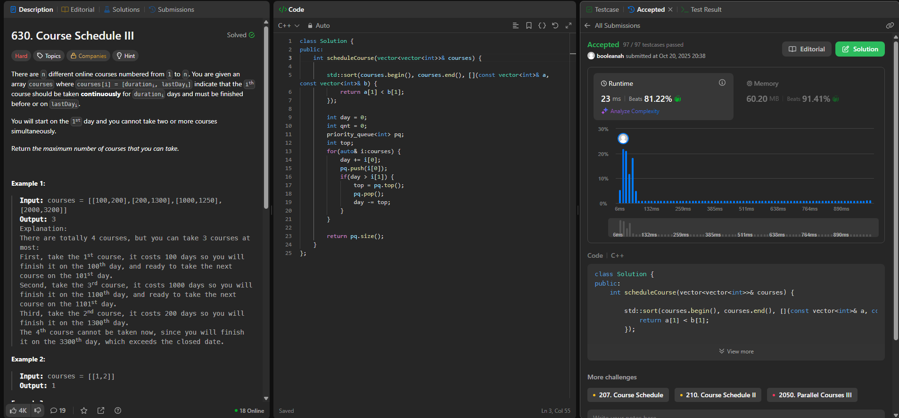
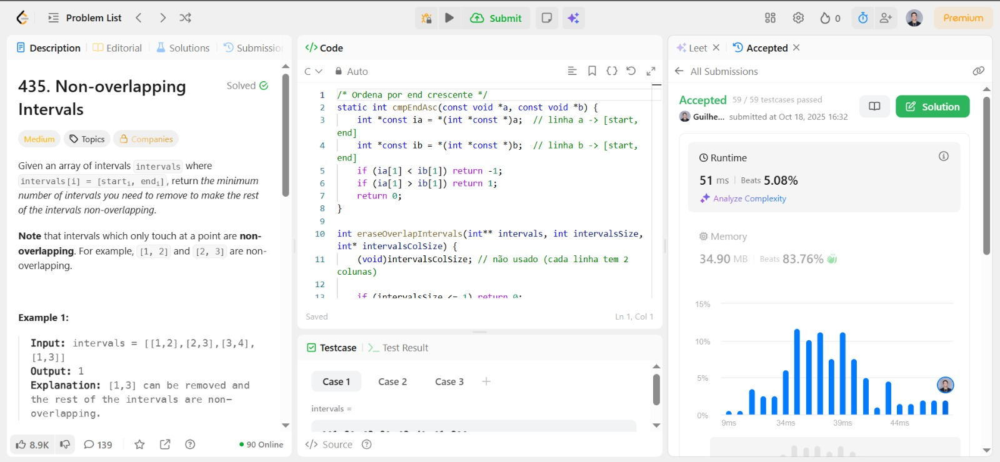
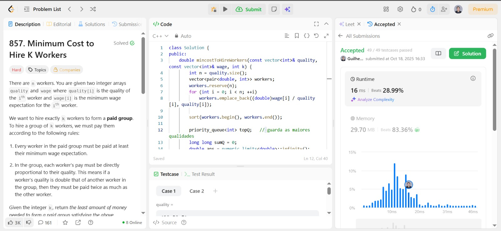

# Algoritmos Ambiciosos

## Vídeo de explicação

https://youtu.be/iIWSnBCi4_E

## Exercícios escolhidos para resolução

|EXERCÍCIO| CONTEÚDO | RESPONSÁVEL | LINK DE ACESSO |
|---|---|---|---|
|2406| Divide Intervals Into Minimum Number of Groups | [Ana Clara](https://github.com/anabborges) | https://leetcode.com/problems/divide-intervals-into-minimum-number-of-groups/description/ |
|630| Course Schedule III | [Ana Clara](https://github.com/anabborges) | https://leetcode.com/problems/course-schedule-iii/?envType=problem-list-v2&envId=greedy |
|435| [  ]Non-overlapping Intervals | [Guilherme Storch](https://github.com/storch7) | https://leetcode.com/problems/non-overlapping-intervals/description/ |
|857| [ Knapsack Fracionário] Minimum Cost to Hire K Workers | [Guilherme Storch](https://github.com/storch7) | https://leetcode.com/problems/minimum-cost-to-hire-k-workers/description/ |

## Prints das submissões

## Ana Clara Borges

### Guilherme Storch

